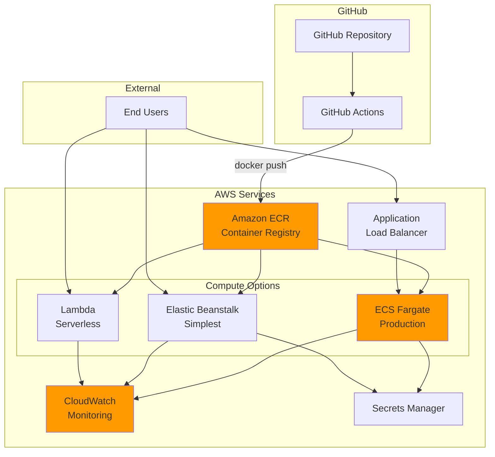

# Project Architecture

## System Architecture Diagram

```mermaid
graph TB
    subgraph "Data Layer"
        DS[(Kaggle Dataset<br/>Wisconsin Breast Cancer)]
        DV[Data Version<br/>SHA256 Hash]
    end

    subgraph "Training Pipeline"
        LD[Load Data]
        PP[Preprocess]
        CV[10-Fold<br/>Cross-Validation]
        TR[Train Final Model]
        EV[Evaluate on Test Set]
    end

    subgraph "MLflow Tracking"
        ML[MLflow Server]
        PAR[Parameters]
        MET[Metrics]
        ART[Artifacts]
    end

    subgraph "Model Promotion"
        CHK{Check<br/>Thresholds}
        PROMO[Promote to<br/>models/latest/]
        REJECT[Log Only]
    end

    subgraph "API Layer"
        API[FastAPI Server]
        PRED[/predict Endpoint]
        HEALTH[/health Endpoint]
    end

    subgraph "Deployment"
        DOCK[Docker Container]
        ECR[AWS ECR]
        ECS[AWS ECS/Fargate]
        EB[Elastic Beanstalk]
    end

    subgraph "CI/CD"
        GHA[GitHub Actions]
        CI[CI Pipeline<br/>Test & Validate]
        CD[CD Pipeline<br/>Build & Deploy]
    end

    DS --> LD
    DV --> LD
    LD --> PP
    PP --> CV
    CV --> TR
    TR --> EV

    EV --> PAR
    EV --> MET
    EV --> ART

    PAR --> ML
    MET --> ML
    ART --> ML

    EV --> CHK
    CHK -->|Recall ≥ 95%<br/>Std ≤ 5%| PROMO
    CHK -->|Criteria Not Met| REJECT

    PROMO --> API
    API --> PRED
    API --> HEALTH

    PROMO --> DOCK
    DOCK --> ECR
    ECR --> ECS
    ECR --> EB

    GHA --> CI
    GHA --> CD
    CI --> TR
    CD --> DOCK

    style PROMO fill:#90EE90
    style REJECT fill:#FFB6C1
    style ML fill:#87CEEB
    style API fill:#DDA0DD
```

## Training Workflow


## API Request Flow


## CI/CD Pipeline Flow


## AWS Deployment Architecture



## Data Flow


---

## Key Design Decisions

### 1. Model Promotion Thresholds
- **Recall ≥ 95%**: Critical for medical diagnosis - minimizes false negatives
- **Std ≤ 5%**: Ensures model stability across different data splits

### 2. MLflow Tracking
- Local file-based tracking for development
- Can be upgraded to remote tracking server for team collaboration

### 3. API Design
- FastAPI for automatic documentation and validation
- Pydantic models for type safety
- Health checks for monitoring

### 4. Deployment Strategy
- Docker for consistency across environments
- Multiple AWS options for different scales
- CI/CD ensures only good models reach production

### 5. Testing Strategy
- Unit tests for core functionality
- Smoke tests in CI (fast, 20% data)
- Full training in CD (before deployment)

---

**For more details, see:**
- [MLFLOW_GUIDE.md](MLFLOW_GUIDE.md) - Training pipeline
- [deployment/DEPLOYMENT.md](deployment/DEPLOYMENT.md) - AWS deployment
- [README.md](README.md) - Complete documentation
